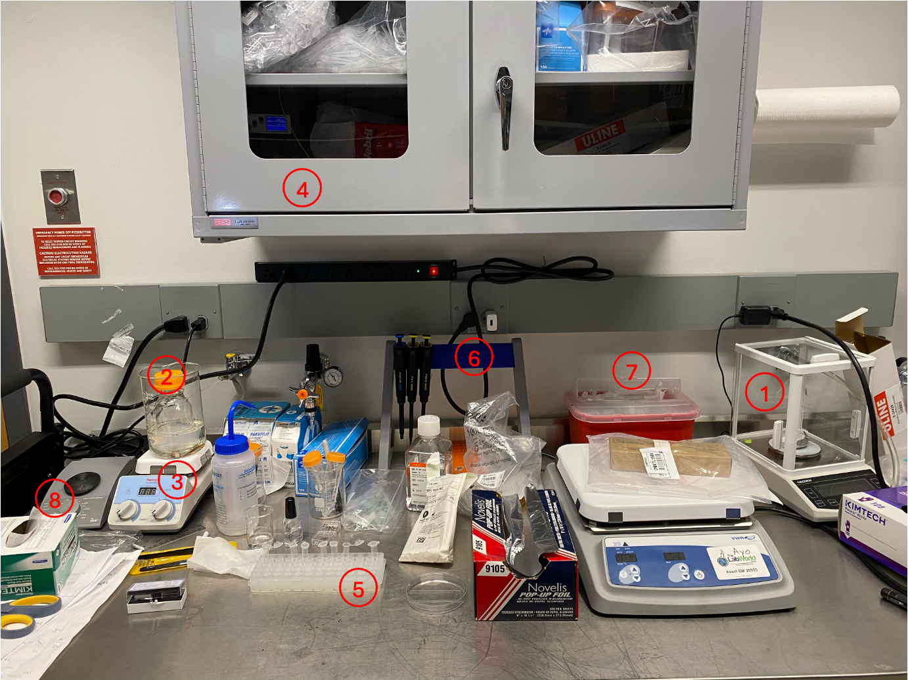
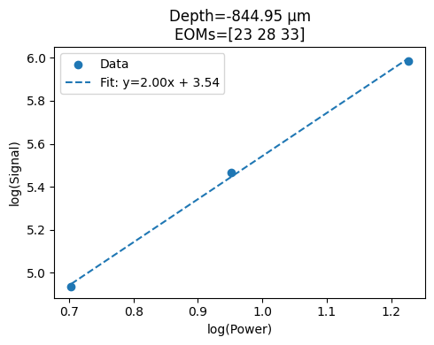
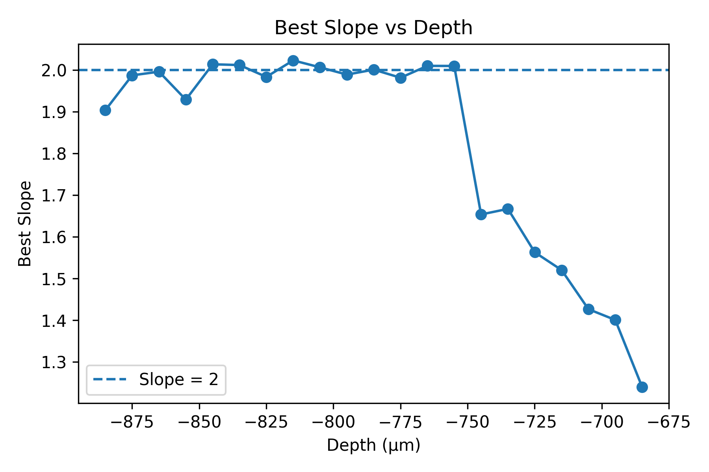
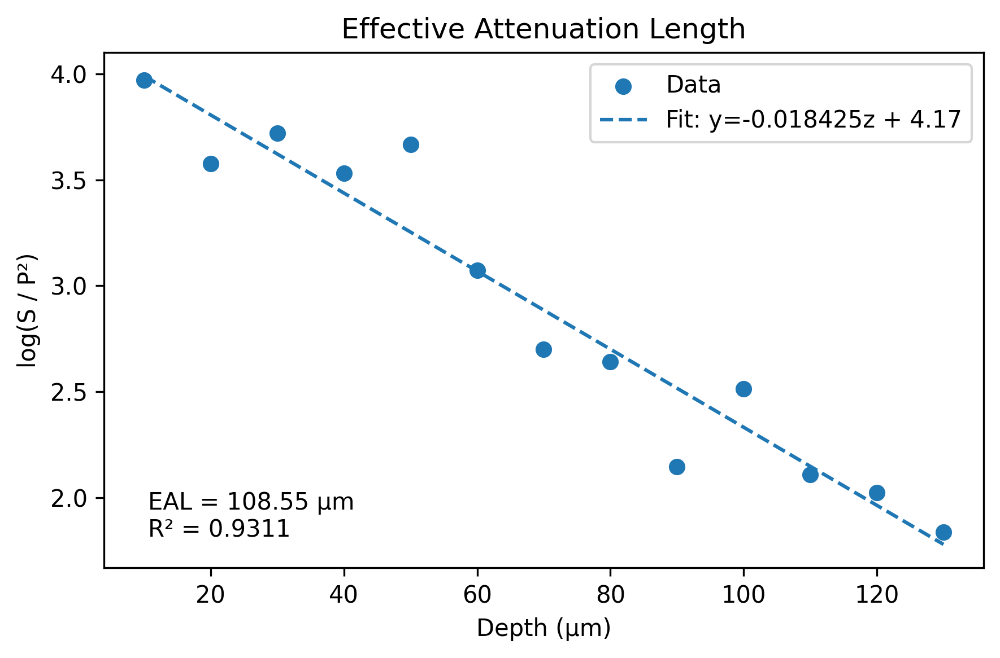

# Effective attenuation length (EAL) measurement protocol

## Material:

- [Agarose](https://www.sigmaaldrich.com/US/en/product/sial/a4018)
- [1um fluorescent beads](https://www.thermofisher.com/order/catalog/product/F13081?SID=srch-srp-F13081): $C_{fluo} = 1\times10^{7}\ \text{beads}/\text{µL}$
- [1um nonfluorescent (polybead) beads](https://polysciences.com/products/polybead-microspheres-100181m?srsltid=AfmBOorjVsqH1_RPydiDL_rl2QxODNqYwh8yssEixcAhqj7QJ9CAVFyL): $C_{poly} = 4.55\times10^{7}\ \text{beads}/\text{µL}$

---

## Dilution calculation

1. Take 1 g of agarose per 100 mL of water as the base medium.
2. The tissue phantom is prepared by mixing:
- $4\ \text{µL}$ fluorescent beads
- $40\ \text{µL}$ nonfluorescent beads
- $156\ \text{µL}$ agarose solution
3. The concentration of fluorescent beads:

$$
\frac{C_{fluo} \times V_{fluo}}{V_{fluo} + V_{poly} + V_{ag}}
= \frac{(1 \times 10^{7}\ \text{beads}/\text{µL}) \times (4\ \text{µL})}{(4 + 40 + 156)\ \text{µL}}
= 2 \times 10^{5}\ \text{beads}/\text{µL}
$$

4. The concentration of nonfluorescent beads:

$$
\frac{C_{poly} \times V_{poly}}{V_{fluo} + V_{poly} + V_{ag}}
= \frac{(4.55 \times 10^{7}\ \text{beads}/\text{µL}) \times (40\ \text{µL})}{(4 + 40 + 156)\ \text{µL}}
= 9.1 \times 10^{6}\ \text{beads}/\text{µL}
$$

5. Ratio between nonfluorescent beads and fluorescent beads:

$$
R = \frac{9.1 \times 10^{6}\ \text{beads}/\text{µL}}{2 \times 10^{5}\ \text{beads}/\text{µL}} = 45.5 : 1
$$

---

## Sample preparation

1. **Make the agarose base medium (if we run out of it)**
- Weigh 1 g of agarose powder using the balance *(labeled as 1 in the figure)*. Add the agarose powder to 100 mL of DI water in the container *(labeled as 2 in the figure)*, and place a magnetic stir bar into the container.
- Place the container into a beaker, then pour 200 mL of water into the beaker.
- Place the beaker on the Cimarec stirring hotplate *(labeled as 3 in the figure)*.
- Set the hotplate temperature to 150 °C and set the stirring speed to 7. Heat until the agarose is fully dissolved and the solution becomes clear (approximately 30 min).
2. **Heat up the agarose. (if we still have agarose in the container)**
- Slightly unscrew the cap of container of agarose.
- Turn on the Cimarec stirring hotplate and set the stirring speed to 7. Heat until the agarose is fully dissolved and the solution becomes clear (approximately 30 min).
3. **Make the tissue phantom samples.**
- Retrieve one microcentrifuge tube from the cabinet *(labeled as 4 in the figure)* and place it into the tube rack *(labeled as 5 in the figure)*. Using the pipettes from the pipette stand *(labeled as 6 in the figure)*, pipette 4 µL of fluorescent beads with a 2–20 µL pipette and 40 µL of nonfluorescent beads with a 20–200 µL pipette into the same tube. Dispose of the pipette tips into the sharps container *(labeled as 7 in the figure)*.
- Using a 20–200 µL pipette, pipette 156 µL of agarose from the container and dispense it into the same microcentrifuge tube. Keep the pipette tip below the liquid surface to avoid bubbles, and mix by pipetting up and down quickly to ensure even mixing before the agarose starts to gel.
- Turn on the mini vortexer *(labeled as 8 in the figure)* and set the speed to 1400 rpm. Place the tube on the vortexer and mix thoroughly (approximately 40 second).
- Using a 20–200 µL pipette, pipette 135 µL of the mixture and dispense it into the United Scientific cavity slide.
- Slowly lower the coverslip from the side so that it gently covers the sample on the cavity slide and avoid pressing down forcefully to reduce bubble formation.
- Lightly press the coverslip with a cotton swab to squeeze out and wipe any excess liquid from the edges using a cotton swab to keep the edges clean.
- Apply nail polish along the four edges of the coverslip to fix it in place and allow it to dry for approximately 5 mins.
- Once the nail polish is dry, apply glue along the four edges of the coverslip to further enhance the seal.
- Mark the date and name of the sample on the slide.
4. **Storage**
- Set the hotplate temperature to 0 °C and set the stirring speed to 0. Turn off the Cimarec stirring hotplate.
- Store the remaining agarose at room temperature and allow it to solidify into a gel as it cools.

---

## EAL measurement (using Bruker microscope system as example)

1. **Background Measurement**
- Close the laser shutter.
- In a dark environment, acquire four images using the PMT to measure the background signal.
2. **Pockels Cell Calibration (Optional)**
- Open the laser shutter and set the laser to the desired wavelength.
- Gradually increase the Pockels cell value and record the corresponding laser power at the focal spot after the beam passes through the objective.
3. **Determination of the Fluorescence Volume in the Tissue Phantom**
- Place the slide on the sample stage. Lower the microscope so that the objective is close to the slide surface (distance less than 1 mm). Apply the appropriate immersion medium between the objective and the slide.
- Set the laser power after the objective to 2 mW. Turn on the scanner and begin scanning the sample. Move the microscope z-stage with a step size of 10 µm to gradually move the objective away from the sample until fluorescence signal is first observed. Record the corresponding z-plane as $z_1$, which represents the lower boundary of the fluorescence volume.
- Continue raising the microscope until the fluorescence signal completely disappears. Record the corresponding z-plane as $z_2$, which represents the upper boundary of the fluorescence volume.
4. **Scanning the Fluorescence Volume**
- Scan the same fluorescence volume ($z_2$ to $z_1$) using a series of different laser powers after the objective (maximum power: 5 mW).
- Use a step size of 10 µm between imaging planes.

---

## Data processing ([code](https://github.com/garyhost0630/Multiphoton-attenuation-length-measurement))

1. **Background Subtraction**
- Calculate the mean of the four background images to obtain the background.
- Correct all images by subtracting the background.
2. **Determination of the Power Range for Unsaturated 2PE for each depth**
- For each imaging depth, calculate the mean intensity of the top 1% brightest pixels in the image as the fluorescence signal at each power.
- Perform a linear fit in log-log space using consecutive power values and their corresponding fluorescence signals, where the x-axis is $\log(\text{power})$ and the y-axis is $\log(\text{signal})$.
- Determine the appropriate power range such that the slope of the fitted line is closest to 2, indicating unsaturated 2PE, as shown in the figure below.

3. **Selection of the Depth Range for EAL Calculation**
- Using the method described in Step 2, determine the optimal power range and the corresponding linear fitting slope for each imaging depth. A summary of the results is shown in the figure below.
- Select a continuous depth range in which the optimal fitting slopes are close to or equal to 2. This depth range is then used for EAL calculation.

4. **EAL estimation**
- For each selected depth, choose the second-highest power within the valid (non-saturated) power range and extract the corresponding fluorescence signal. Normalize the fluorescence signal by the excitation power.
- Perform a linear fit between imaging depth and the log of the normalized fluorescence signal.
- Obtain the slope $k$ and compute EAL using $\text{EAL} = -2/k$ as shown below.

